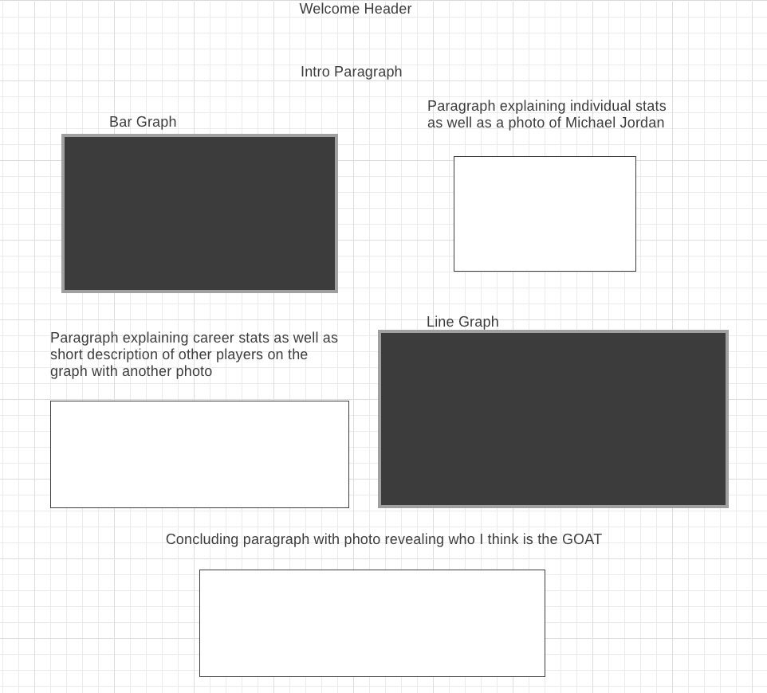
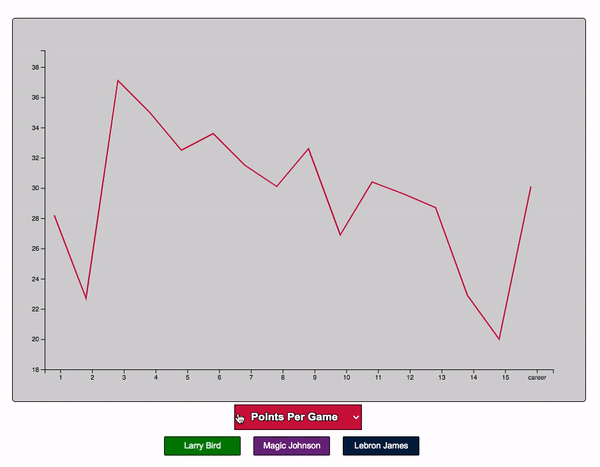
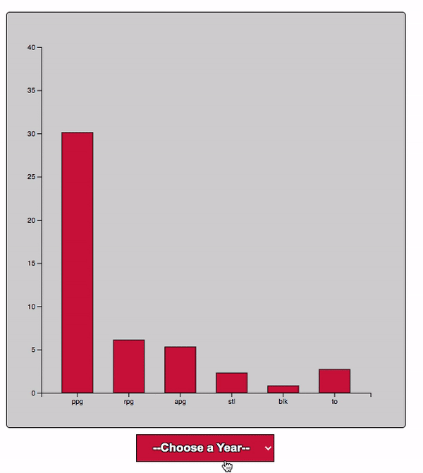

# GOAT


[Live Site](https://connorbrabant.github.io/Basketball)

## Background and Overview
This app will be a mesh between a data analysis and game. It will focus on a select few players from the history of the NBA and display
graphs and data about their individual stats and accolades. It will also feature a game where players can play a simplified version
of a one on one game. 

There are few people who transcend their line of work and become immortalized as the pinnacle of said field. For basketball, this person is Michael Jordan. Jordan redefined the game of basketball while exploding the NBA's popularity in the world. Many people call him the GOAT of the NBA. GOAT is a web application that allows users to dynamically interact with Michael Jordan's stats throughout his career and give insight into why most consider him the best ever. 

## Functionality and MVPS 
Users are able to
  * view dynamic bar graph displaying Michael Jordan's stats for each year he played in the NBA 
  * interact with line graph that compares Jordan's career stats to other NBA greats
  
 ## Wireframe
 
 
 ## API and Technology 
 * JavaScript
 * HTML 5 
 * CSS 3  
 * D3.js library to construct graphs to displaying data
 
 ## Highlighted Features
 
 ### Line Graph
 

The implementation of a graph that dynamically changes based on user input is dependent on what data to display on the axes. For the line graph, it must account for the length of each player's career as well as the range between players for the maximum and minimum value of the statistics to show. These values must constantly be readjusted for each player or stat the user chooses to display. Below shows the process for choosing what values to render for the y-axis. 
```javascript
    const yAxisValues = {
        'max': null,
        'min': null
    };
    
let changed = false; 
            let statsMinAndMax = Object.values(stats).map(ele => ele[stat])
            if (!yAxisValues['max'] || yAxisValues['max'] < Math.max.apply(Math, statsMinAndMax)) {
                yAxisValues['max'] = Math.max.apply(Math, statsMinAndMax)
                changed = true;
            } 
            if (!yAxisValues['min'] || yAxisValues['min'] > Math.min.apply(Math, statsMinAndMax)) {
                yAxisValues['min'] = Math.min.apply(Math, statsMinAndMax)
                changed = true;
            } 
```
When a user selects a player, their data is run through this code in order to determine the maximum and minimum of the stat to display on the graph's y-axis. A player's maximum and minimum in a specific stats is compared to the current maximum/minimum of other players stored in the yAxisValues object. If their maximum stat is higher than the max value stored in the object or their minimum stat is lower than the minimum stored, it will set the key max or min to the appropriate value in order to store the highest value that has been processed so far. If its the first player's data, it will automatically set it as the max and min values. This allows the y-axis to be generated dynamically in order to generate the optimal range for the y-axis.

The graph must also determine which player's career was the shortest in order to only render each player's data up to this year for an accurate comparison between one another. The code below shows the logic to determine this which also serves as the logic to re-render the axes if certain conditions are met.
```javascript
let xAxisValues = null;

if (!xAxisValues || xAxisValues > stats.length || changed) {
                xAxisValues = stats.length;
else if (stats.length >= xAxisValues) {
                statsToRender = stats.slice(0, xAxisValues - 1).concat(Object.values(stats)[stats.length - 1]);
            }
```
Stats is an array of the player's career statistics where the length of the array is equal to the amount of seasons played plus an extra index for their career average. If there is no previous xAxisValues or the current xAxisValues is greater than the current player's career length, the graph needs to be rendered to only the show the amount of seasons played by the current player who is being processed. Also if changed,a variable seen in the code above that accounts for if the y-axis values have changed, is set to true, the graph must rerender. If any of these conditions to rerender are met, the xAxisValues variable is reassigned to this new, lower amount of seasons played to be compared to any future players that may be selected by the user. The else if conditional accounts for players who careers are longer than the career length currently shown by the x-axis. It slices the player's data up to the highest year shown by the graph and then concatentates the career average to this newly sliced array.

### Bar Graph 


For the bar graph, the bars themselves needed to change based on what year the user is selecting. When the user would select a new year, that specific year's data would be retrieved and then be used to structure the new bars that had to be rendered. The bars height is the only visual aspect of the bar that needs to change as the x-axis value remain the same from year to year. In order to visualize the change from year to year, a transformation was used.

```javascript 
dropdown.on("change", function () {

            year = d3.event.target.value;
            let subData = [];
            for (ele in allData[year-1]) {
                let obj = {}
                obj['stat'] = ele
                obj['value'] = parseFloat(allData[year-1][ele])
                subData.push(obj);
            }
            data = subData.slice(1);
            
            const bar = svg.selectAll('rect')
            bar
                .data(data)
                .enter()
                .append('rect')
                .merge(bar)
                .transition()
                .duration(1000)
                .attr("y", function (d) {
                    return yScale(d.value)
                })
                .attr("height", function (d) { return height - yScale(d.value) });  

        });
```

 ## Implementation Timeline
### Day 1
* Implementation of webpack and modules
* Basic structure of page
### Day 2 
* Learning D3.js library 
* Retrieving and researching data to use for graphs
### Day 3
* Creating bar graph for Jordan's individual seasons stats
* Outline of line graph
### Day 4
* Creating line graph for Jordan and other players' career stats
* CSS styling for webpage
